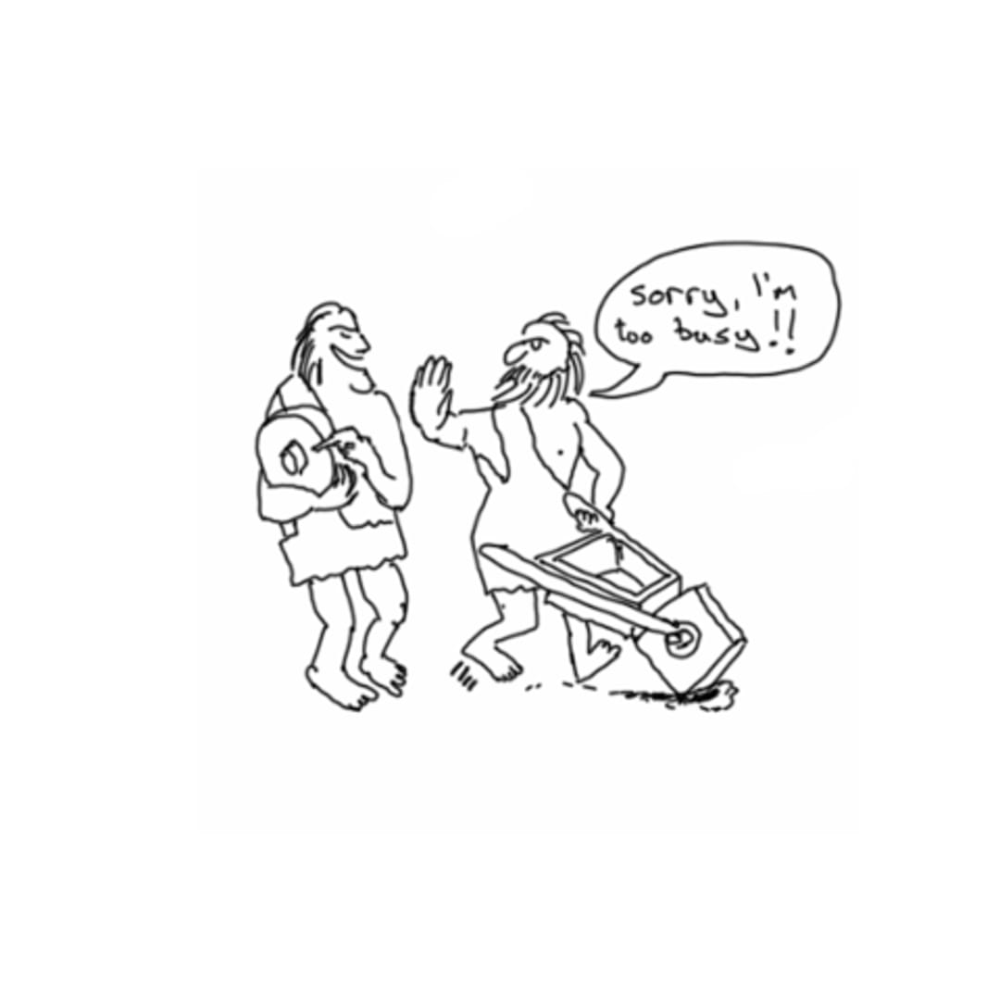

## Do we even need to reinvent the wheel?

Imagine a life without the invention of the wheel. Hard to picture, right? Fortunately, you don't have to. The wheel has already been invented! The wheel is possibly the greatest invention that humans have created. Chances are that you use or see a wheel every day, either as transportation on a car or skateboard, for comfort as an electric fan, for tools such as a drill or a pizza cutter, or for watching your favorite television game show, "Wheel of Fortune". While not exactly a one-to-one function, the same case can be applied to software design. In this case, the "wheel" is called "design patterns". Let's say you have a problem during your software development that you swear you have encountered before. A design pattern would be your solution. Like the wheel, a design pattern is essentially a template that can be used for a multitude of situations.

## Have I reinvented the wheel?

No. I don't have to! Although my understanding of them is minimal, design patterns have been used in my code unknowingly. For my ICS 314 class, our final project was to build an application with a team. For my particular team, we were to create a centralized directory of student clubs at our university. More information on the project can be found on our [GitClubs project home page](https://uhm-gitclubs.github.io/). Since we used JavaScript and the Meteor web framework for this project, design patterns for those can also be found in the project. Some design patterns that were used in this project were Prototype<a href="#footnote-0">0</a>, Observer<a href="#footnote-1">1</a>, and Publish-Subscribe<a href="#footnote-2">2</a>. As you have read, design patterns play a big role in software engineering. Like me, they may have been in your code all along...

0: Used when the type of objects to create is determined by a prototypical instance, which is cloned to produce new objects.

1: An object, named the subject, maintains a list of dependents, named the observers, and notifies them automatically of any state changes.

2: Messaging pattern where senders of messages, called publishers, categorize messages into classes without knowledge of which subscribers, if any, there may be.

 