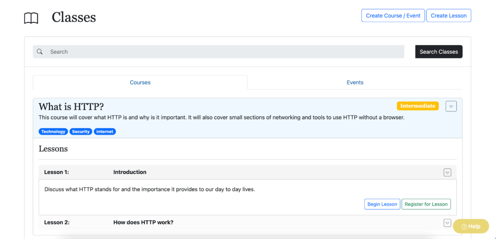
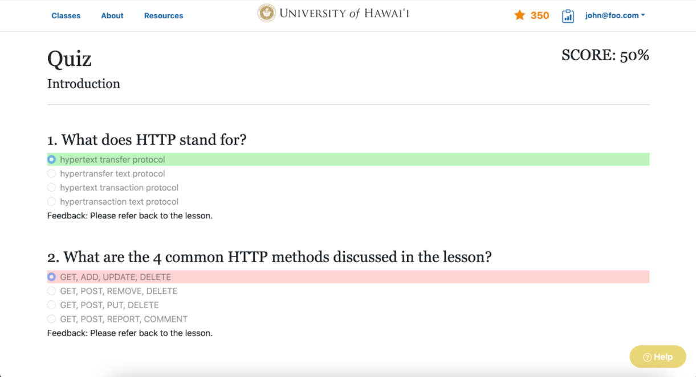
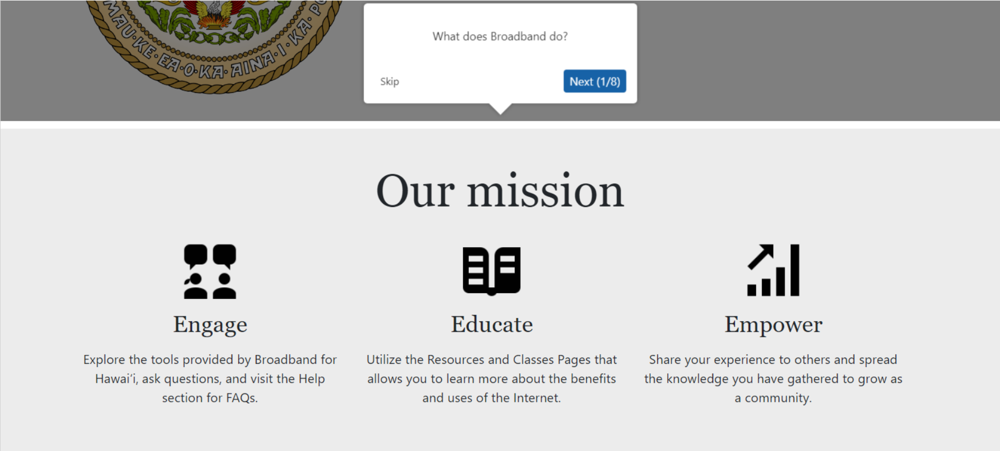
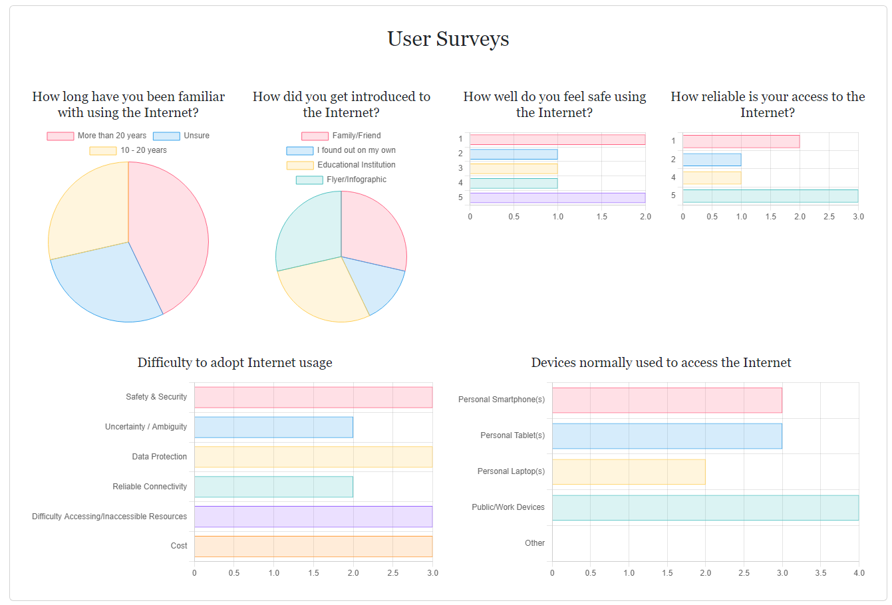

Modern society is reliant on technology for everyday tasks, and not everyone can access online services. The COVID-19 pandemic magnified this **digital divide** as remote work and schooling was challenging for individuals lacking basic information technology skills.

Broadband for Hawaii was created as a solution to this problem. Broadband for Hawaii is an interactive, accessible online platform that encourages people to learn more about the internet and technology through classes and workshops. 

This application is catered towards people of all backgrounds from students K-12, parents, and family members, to the general public and community members who may be unfamiliar with connecting to and using the internet.

  
  

  
  

###### Features of the app:
- **Three User Roles**: General Public, User, and Admin
- **Multiple Learning Modes**: Classes, Sessions, Quizzes
- **Security**: Personally Identifiable Information (PII) protection mechanisms in place (2FA)
- **Data Analytics**: For admin use - user demograhics, quiz scores, and survey data
- **Simple and Intuitive User Interface/Experiece**: Quick start
- **Gamification**: Rewards for completing lessons and quizzes
- **Accessability**: ADA Compliant
- **Engaging**: Learners are encouraged to master each quiz

This project was created in a team of 6 as part of the 2022 Hawaii Annual Coding Challenge and won 3rd place for coded solutions. For more details, read our devpost hackathon submission: <a href="https://devpost.com/software/chipmunks">Broadband for Hawaii</a>
