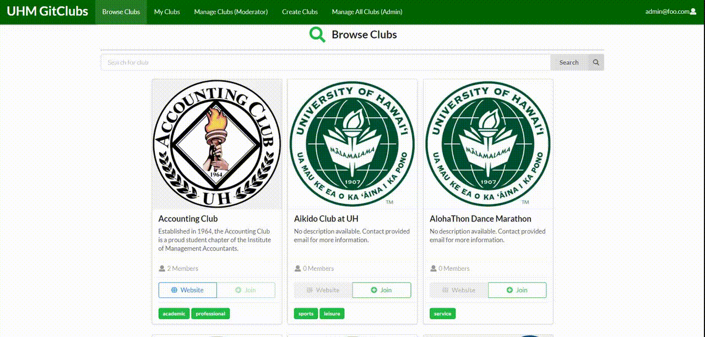

 

UHM GitClubs is a website application that was created by my team and I as a final project in ICS 314. It was tailored to UH Manoa students as it provided a centralized directory for student clubs at the university. While it is for UH Manoa students, anyone can visit the website to just take a look at what kind of clubs are available. Each club has a description, a link to their website if available, and contact information. UH Manoa students can create an account and join a club in the directory.

 

 

For this project, my contributions included designing mockups for the pages, creating the database for the project, implementing a search and filter for the browsing page, and management of the team and GitHub documentation page. Despite being fully online, our team was able to finish the project in an orderly fashion through good communication using Discord. I gained a lot from this project, including my first experience on working on a group coding project and putting everything I learned this semester into one application. I feel that this project helped to simulate a real-life work environment. This was beneficial as it gave me a change to improve my communication and group skills, as well as improved my understanding on project management and software engineering. 

Source: <a href="https://uhm-gitclubs.github.io/">GitHub/uhm-gitclubs</a>
